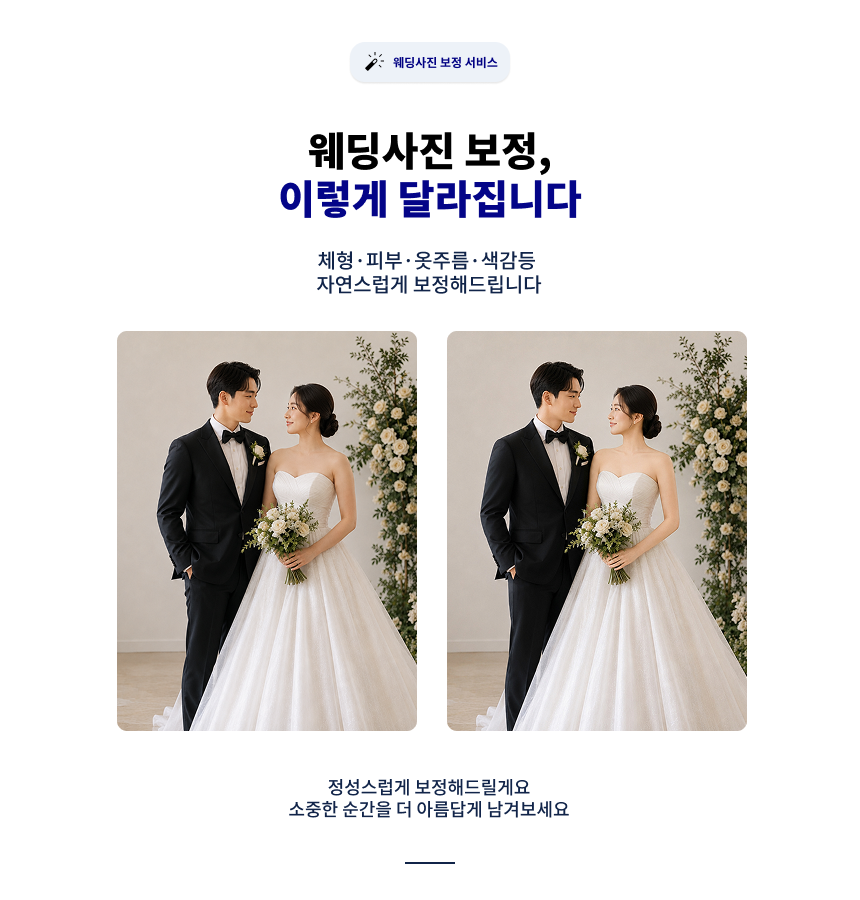
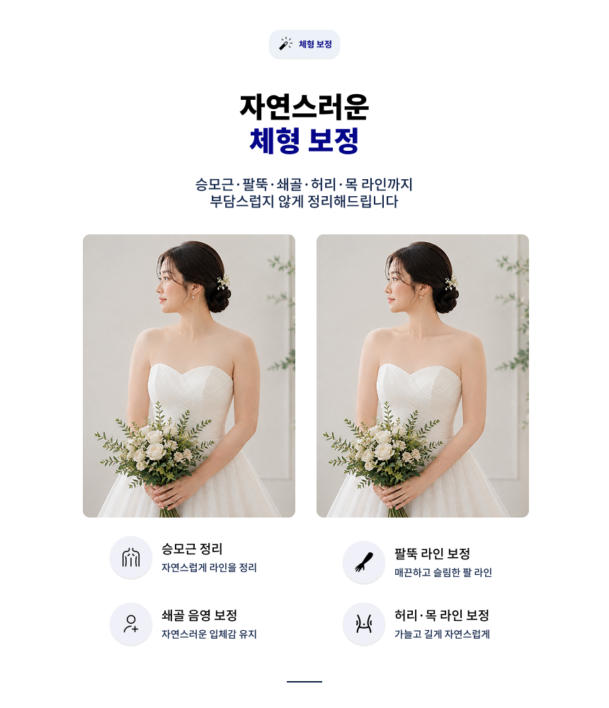
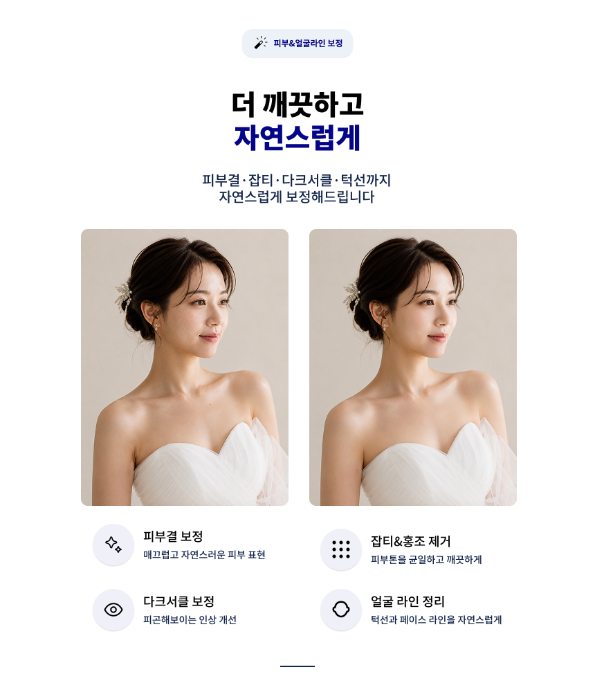
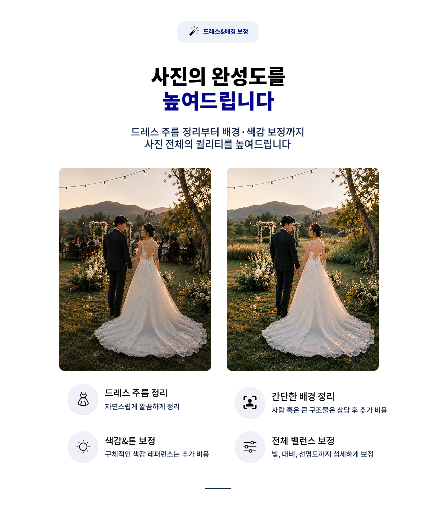
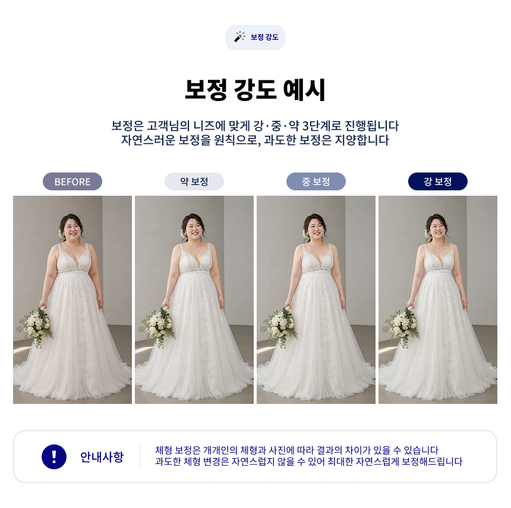
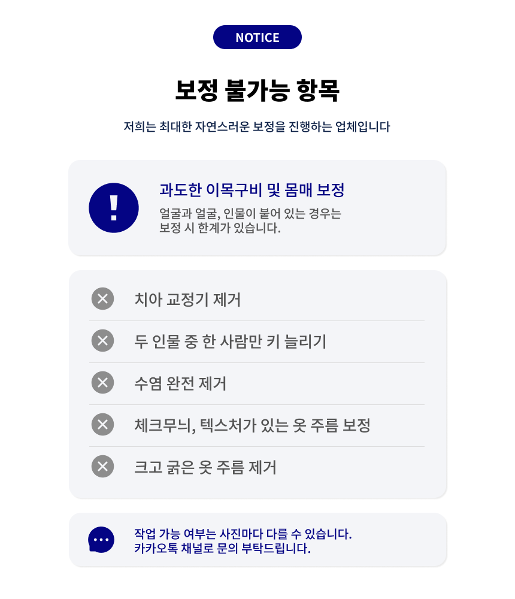
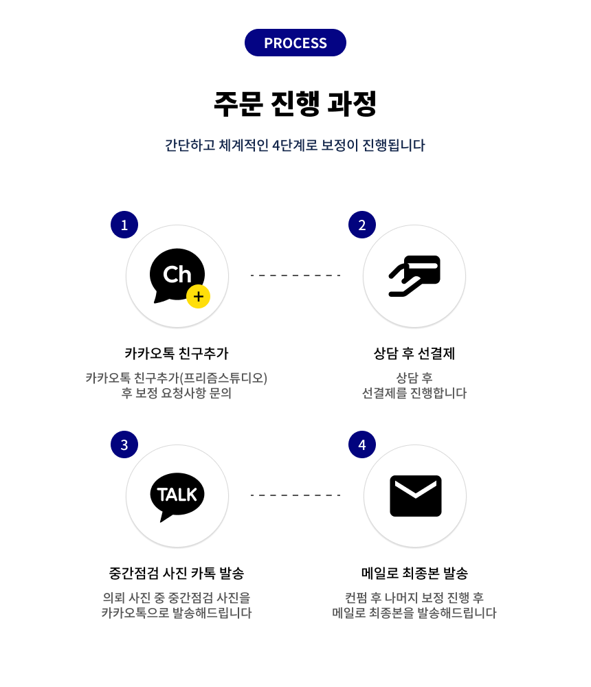
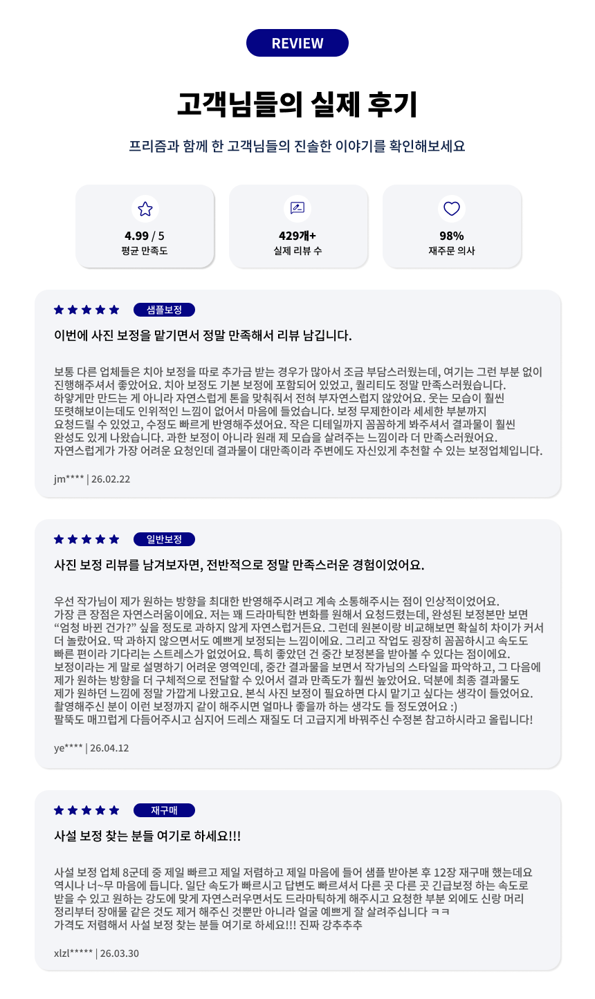
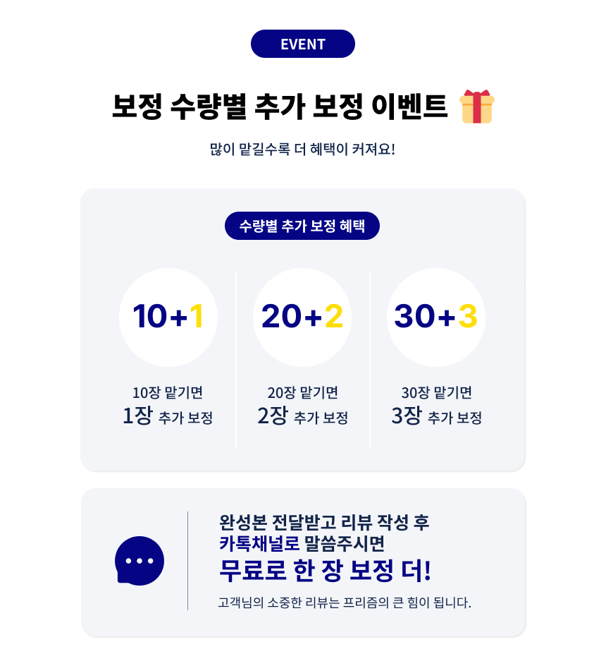

# 웨딩 사진 보정 상세페이지

## Background

웨딩 사진 보정 서비스의 특징과 보정 결과를 고객에게 효과적으로 전달할 수 있는 상세페이지가 필요했습니다.

사진 보정 서비스는 결과물의 품질이 구매 결정에 큰 영향을 주기 때문에 단순한 설명보다 실제 보정 전후의 차이와 서비스 범위를 직관적으로 보여주는 것이 중요했습니다.

이에 사용자가 서비스의 특징과 보정 결과를 빠르게 이해하고 구매까지 이어질 수 있도록 상세페이지를 기획했습니다.

---

## My Role

* 상세페이지 콘텐츠 구조 설계
* UX 문구 작성 및 개선
* Before / After 콘텐츠 구성
* AI 이미지 생성 및 활용
* Figma 상세페이지 디자인
* 최종 상세페이지 제작

---

## Approach

### 1. 상세페이지 구조 설계

사용자가 서비스를 처음 접했을 때 궁금해할 내용을 기준으로 정보의 우선순위를 정하고 전체 페이지 흐름을 구성했습니다.

* 서비스 핵심 특징
* Before / After
* 보정 가능 범위
* 서비스 이용 과정
* 상품 및 가격 안내
* 자주 묻는 질문
* 구매 CTA

---

### 2. 보정 결과 시각화

사진 보정 서비스의 특성상 설명보다 실제 결과를 보여주는 것이 중요하다고 판단하여 Before / After 콘텐츠를 중심으로 구성했습니다.

특히 다음 사항을 고려하여 이미지와 콘텐츠를 제작했습니다.

* 보정 전후 차이가 직관적으로 보이는 구성
* 과도하지 않고 자연스러운 보정 결과 표현
* 다양한 보정 항목을 이미지 중심으로 전달
* 전체 상세페이지의 톤앤매너 통일

---

### 3. UX 개선

사용자가 긴 설명을 모두 읽지 않아도 서비스의 핵심 내용을 빠르게 파악할 수 있도록 시각적 정보 전달에 집중했습니다.

* 핵심 문구 최소화
* 이미지 중심의 정보 구성
* 보정 항목별 콘텐츠 구분
* 구매 흐름을 고려한 CTA 배치

---

## Result

* 웨딩 사진 보정 상세페이지 제작
* Before / After 기반 보정 결과 시각화
* 서비스 특징 및 보정 범위 구조화
* 실제 서비스 판매에 활용 가능한 상세페이지 자산 확보

---

## Final Output

## Final Output

---

## What I Learned

* 사진 보정 서비스는 설명보다 Before / After를 통한 시각적 설득이 중요하다는 점
* 상세페이지에서 정보의 양보다 사용자가 어떤 순서로 정보를 접하는지가 중요하다는 점
* AI 이미지와 디자인 도구를 활용해 기획부터 최종 콘텐츠 제작까지 효율적으로 진행할 수 있다는 점
* 단순히 보기 좋은 디자인이 아니라 실제 구매 전환을 고려해 콘텐츠를 설계하는 경험을 얻을 수 있었습니다.
